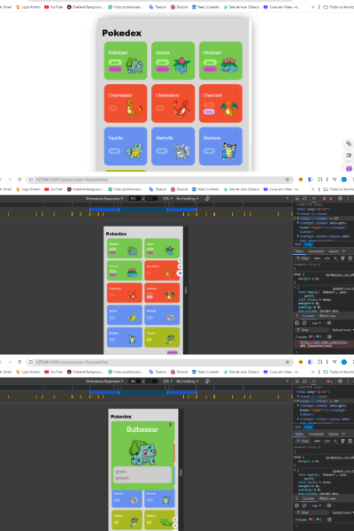

# Desafio de criação de projeto criado pela DIO. 

## pokedex

<<<<<<< HEAD

=======

>)
>>>>>>> 9ecb95ca3d904357cbf1579edce805e9f8dca46e

Esses app foi desenvolvido usando as tecnológias:

* Html5
* Css3
* JavaScript
* NodeJs

Fique a vontade para fazer melhorias ou sugestoes 🤗

### Tera mais projetos aqui. Até lá. 😉🚀🚀🚀
